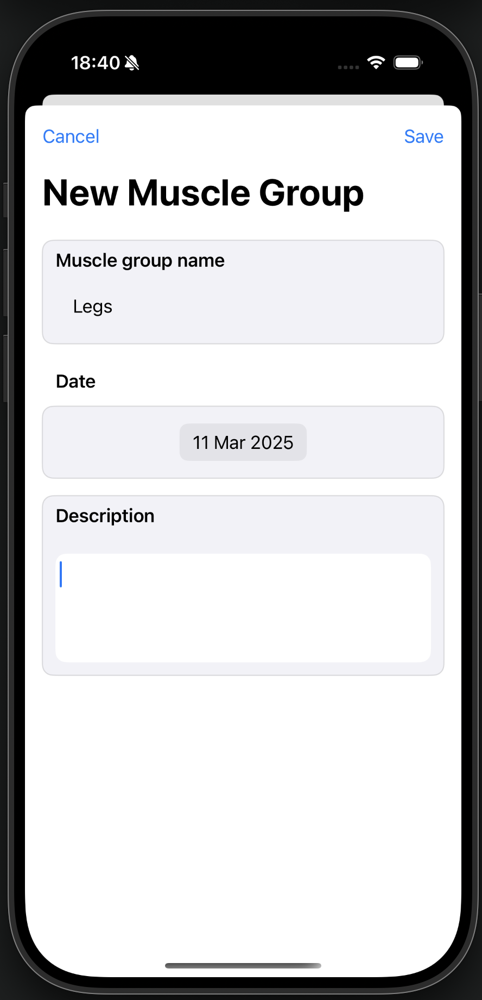
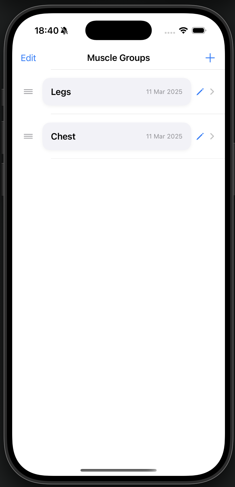
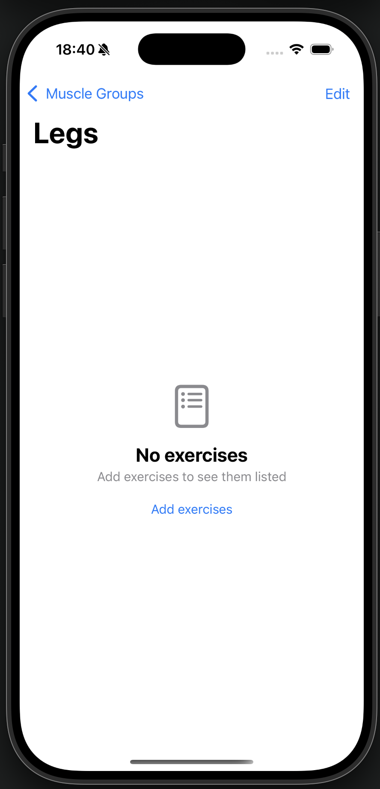
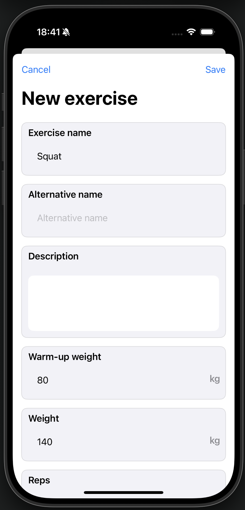
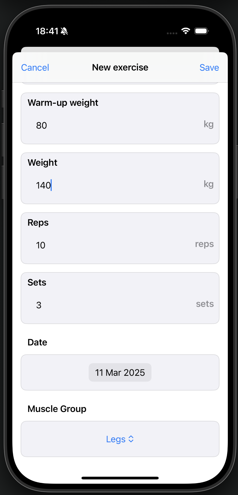
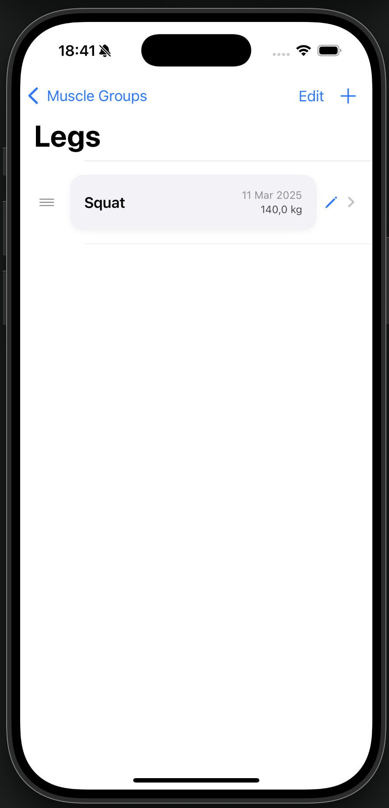
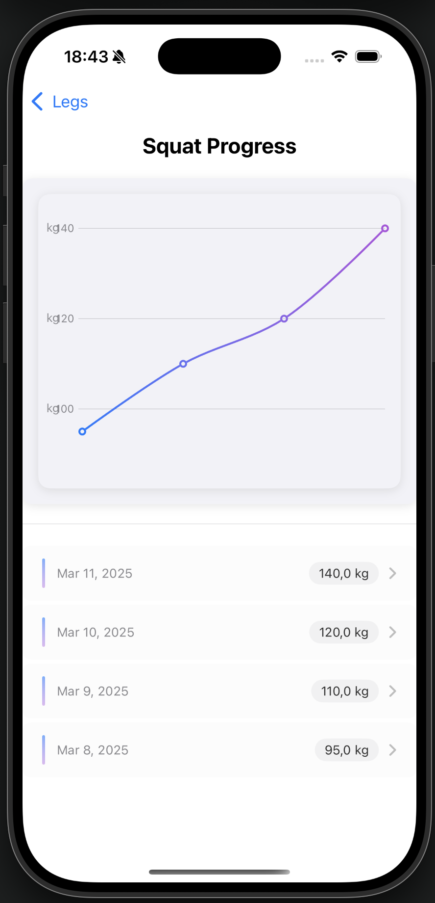

# Welcome to the Workout Tracker app!
This app was a project I had to make an app that tracked gym progress while respecting users privacy. It collects **NO** data. Everything is stored locally. Everyone is free to use this app, just not commercially use it to make profit. I know the app isn't perfect, so suggestions are always welcome!

The app is published here since the apple developer subscription is prohibitively expensive for a hobby project.

## App structure
The app is structured as follows: 
- First you can make a "muscle group". This is to assign categories to each exercise.   
- Secondly you can create exercises.   
- Each time an exercise is updated, a workout entry is created. This is the way that previous workouts gets logged and tracked.
- Previous workouts can be consulted, and a graph of the weight used in the workouts is plotted. 

## Future ideas
- Integrate native iCloud sync
- Add emoji support
- Track the order of workouts in a given exercise session
- Make the UI/UX more intuitive
